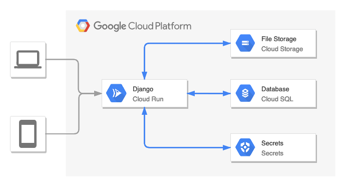

# Django application on Google Cloud Platform.

<!-- START doctoc generated TOC please keep comment here to allow auto update -->
<!-- DON'T EDIT THIS SECTION, INSTEAD RE-RUN doctoc TO UPDATE -->
**Table of Contents**

- [Introduction](#introduction)
- [Google Cloud options](#google-cloud-options)
  - [App Engine](#app-engine)
  - [Cloud Run](#cloud-run)
- [Prerequisites](#prerequisites)
- [Instructions](#instructions)
  - [1. Types of deployments](#1-types-of-deployments)
  - [2. Variables specific for your GCP project](#2-variables-specific-for-your-gcp-project)
  - [3. Set up infrastructure](#3-set-up-infrastructure)
  - [4. Deploy app](#4-deploy-app)
  - [5. Destroy infrastructure](#5-destroy-infrastructure)
  - [Extra: Create Django superuser](#extra-create-django-superuser)
  - [How to run app locally](#how-to-run-app-locally)
- [Warnings!](#warnings)
- [Links](#links)

<!-- END doctoc generated TOC please keep comment here to allow auto update -->


## Introduction

The Cloud is consistently growing and it may be worth considering for your next Python project.
But Cloud is also very complex and the number of available services is still growing, as well as the number of decisions that have to be made when you want to create configuration for your project.
If you want to learn how to run a simple, basic Django app in the Google Cloud Platform [GCP] and see how easy it can be as well as to get the underlying services in the form of the code (Infrastructure as Code [IaC]), this is a place for you.

There are many ways to deploy a Django application on the GCP:

 - App Engine (covered here)
 - Cloud Run (covered here)
 - Kubernetes (TODO)
 - Compute Engine (not covered here)

Most of them are covered in [GCP documentation](https://cloud.google.com/python/django/) which is quite good in my opinion, however if you are not familiar with the Cloud, all these services and operations may seem confusing (and redundant).
Django apps mentioned in these tutorials are almost the same, they have changes dependent on the service type on which they were supposed to be running of course, nevertheless some changes are not related.
Moreover, I found some of the tutorials and apps to contain tiny bugs.

So what I have done here is a simple Django application (based on Django project tutorial:  [Writing your first Django app](https://docs.djangoproject.com/en/3.2/intro/tutorial01/), where all changes which are specific to given GCP services are grouped and can be found in the possible fewest number of places for an easy analysis.
Additionally, infrastructure is wrapped in the Terraform (IaC tool) which allows you to easily create (and destroy) all necessary resources.
The process of deploying application itself is not handled by Terraform ([Don’t Deploy Applications with Terraform - Paul Durivage](https://medium.com/google-cloud/dont-deploy-applications-with-terraform-2f4508a45987)), but it is wrapped in the easy to follow Google Cloud Build [GCB] pipelines,
separate for each service. Due to the fact that inheritance between GCB pipelines is not possible, they have a lot in common but analysis of differences between them should not be a problem for you.
For GCB purposes I wrapped the app in Docker, even though the App Engine does not require it, but it was the easiest way to provide proxy connection to Cloud SQL database ([app-engine-exec-wrapper,](https://github.com/GoogleCloudPlatform/ruby-docker/tree/master/app-engine-exec-wrapper)).

Hopefully such a condensed project may help you learn how GCP services may be used along with Python projects, so some ideas could be picked up in the future.


## Google Cloud options

### App Engine

  > App Engine is a fully managed, serverless platform for developing and hosting web applications at scale. You can choose from several popular languages, libraries, and frameworks to develop your apps, and then let App Engine take care of provisioning servers and scaling your app instances based on demand.
  >
  > -- [App Engine documentation](https://cloud.google.com/appengine/docs)

  

### Cloud Run

  > Cloud Run is a managed compute platform that enables you to run containers that are invocable via requests or events. Cloud Run is serverless: it abstracts away all infrastructure management, so you can focus on what matters most — building great applications.
  >
  > -- [Cloud Run documentation]()

  

## Prerequisites

Topics you should be familiar with since they will be not covered:

 - Python and Django
 - Cloud - basic cloud concepts in general
 - Google Cloud Platform: basics of the services, use of `gcloud` CLI, managing billing, documentation about [Django on GCP (GCP documentation)](https://cloud.google.com/python/django/)
 - Terraform -  basic use and concepts. You can also check my tutorial on Medium: [Terraform Tutorial: Introduction to Infrastructure as Code](https://tobiaszkedzierski.medium.com/terraform-tutorial-introduction-to-infrastructure-as-code-dccec643bfdb)

What you should prepare:
 - Google Cloud Project - create a fresh GCP project or use an existing one (however it may cause Terraform exceptions)
 - [`gcloud`](https://cloud.google.com/sdk/gcloud) - install GCP cli and authorize it with a relevant GCP Project
 - [Terraform](https://www.terraform.io/downloads.html) - install the latest version
 - Python [optionally] - Python 3.9 in virtual environment if you want to run Django app locally


## Instructions

Most of the terminal commands stated here are executed within the Terraform environment folder relevant to chosen solution.

### 1. Types of deployments

| Terraform environment folder           | Description                                             | GCS | `CLOUD_BUILD_FILE` variable             | Config file                  | Used Terraform module                                                               |
|----------------------------------------|---------------------------------------------------------|-----|-----------------------------------------|------------------------------|-------------------------------------------------------------------------------------|
| `terraform/envs/gae_standard`          | App Engine Standard environment **without** GCS storage | ❌   | `cloudbuild/gae_standard.yaml`          | `gae_standard.yaml`          | [`terraform/modules/django_gae_standard`](./terraform/modules/django_gae_standard) |
| `terraform/envs/gae_standard_with_gcs` | App Engine Standard environment                         | ✅   | `cloudbuild/gae_standard_with_gcs.yaml` | `gae_standard_with_gcs.yaml` | [`terraform/modules/django_gae_standard`](./terraform/modules/django_gae_standard) |
| `terraform/envs/gae_flexible`          | App Engine Flexible environment                         | ✅   | `cloudbuild/gae_flexible.yaml`          | `gae_flexible.yaml`          | [`terraform/modules/django_gae_flexible`](./terraform/modules/django_gae_flexible) |
| `terraform/envs/cloud_run`             | Cloud Run                                               | ✅   | `cloudbuild/cloud_run.yaml`             | -                            | [`terraform/modules/django_cloud_run`](./terraform/modules/django_cloud_run)       |

### 2. Variables specific for your GCP project

 1. Shell environmental variables

    Set environmental variables.
    Some values you have to know by hard, like `PROJECT_ID`.
    Others you can generate on the fly, like `DJANGO_SECRET_KEY` however remember to keep them somewhere (see next step).
    They will be used to provide input variables for terraform and for `gcloud` commands.

    ```bash
    export PROJECT_ID=django-cloud-tf-test-001
    export REGION=europe-central2
    export ZONE=europe-central2-a
    export SQL_DATABASE_INSTANCE_NAME="${PROJECT_ID}-db-instance"
    export SQL_DATABASE_NAME="${PROJECT_ID}-db"
    export SERVICE_NAME=polls-service
    export SERVICE_ACCOUNT_NAME=polls-service-account  # for cloud run
    export SERVICE_ACCOUNT="${SERVICE_ACCOUNT_NAME}@${PROJECT_ID}.iam.gserviceaccount.com"   # for cloud run

    export DJANGO_SECRET_KEY=$(cat /dev/urandom | LC_ALL=C tr -dc '[:alpha:]'| fold -w 50 | head -n1)
    export SQL_USER=$(cat /dev/urandom | LC_ALL=C tr -dc '[:alpha:]'| fold -w 10 | head -n1)
    export SQL_PASSWORD=$(cat /dev/urandom | LC_ALL=C tr -dc '[:alpha:]'| fold -w 10 | head -n1)
    ```

 2. `gcloud` config project

    ```bash
    gcloud config set project $PROJECT_ID
    ```

 3. Terraform variables

    Terraform can read variables from environment variables.
    Naming convention is `TF_VAR_variable_name`.

    ```bash
    export TF_VAR_project_id=$PROJECT_ID
    export TF_VAR_region=$REGION
    export TF_VAR_zone=$ZONE
    export TF_VAR_django_secret_key=$DJANGO_SECRET_KEY
    export TF_VAR_sql_database_instance_name=$SQL_DATABASE_INSTANCE_NAME
    export TF_VAR_sql_database_name=$SQL_DATABASE_NAME
    export TF_VAR_sql_user=$SQL_USER
    export TF_VAR_sql_password=$SQL_PASSWORD
    export TF_VAR_cloud_run_service_account_name=$SERVICE_ACCOUNT_NAME
    ```

    Another way to provide input variables is `.tfvars` file.
    With variables set in previous such file could be generated with following command:

    ```bash
    cat << EOF > terraform.tfvars
    project_id                     = "$PROJECT_ID"
    region                         = "$REGION"
    zone                           = "$ZONE"
    django_secret_key              = "$DJANGO_SECRET_KEY"
    sql_database_instance_name     = "$SQL_DATABASE_INSTANCE_NAME"
    sql_database_name              = "$SQL_DATABASE_NAME"
    sql_user                       = "$SQL_USER"
    sql_password                   = "$SQL_PASSWORD"
    cloud_run_service_account_name = "$SERVICE_ACCOUNT_NAME"
    EOF
    ```

    More about variables: [Input Variables](https://www.terraform.io/language/values/variables) and [Variable Definition Precedence](https://www.terraform.io/language/values/variables#variable-definition-precedence)

### 3. Set up infrastructure

Set up infrastructure with basic Terraform commands:

```bash
terraform init
terraform plan
terraform apply
```

Known issues:

 - [No way to delete an application ](https://issuetracker.google.com/issues/35874988) - 13 years old google issue:

   ```Error: Error creating App Engine application: googleapi: Error 409: This application already exists and cannot be re-created., alreadyExist```

    After destroying infrastructure and applying again this error will occur since the previous App Engine app was (silently) not deleted.
    It could be fixed by importing existing App Engine into terraform state:

    ```shell
    terraform import module.$TERRAFORM_MODULE_NAME.google_app_engine_application.app "${PROJECT_ID}"
    ```

    Replace `$TERRAFORM_MODULE_NAME` with relevant module name (see `main.tf` in env of your choice).

    Example for `django_gae_standard`:

    ```shell
    terraform import module.django_gae_standard.google_app_engine_application.app "${PROJECT_ID}"
    ```

    More about importing: [Terraform - import](https://www.terraform.io/docs/cli/import/index.html)

 - random null for `data.google_project.project.number` ([my comment on `hashicorp/terraform-provider-google - data.google_project.project.project_id sometimes null` issue](https://github.com/hashicorp/terraform-provider-google/issues/10587#issuecomment-984589651)):

    ```The expression result is null. Cannot include a null value in a string template.```

    The only solution here is to retry until it works and wait until the new version of `hashicorp/terraform-provider-google` will not have this issue.

### 4. Deploy app

In my opinion when possible Terraform should be used to provide infrastructure only and
deployment of the application itself should be handled separately
(see [Don’t Deploy Applications with Terraform - Paul Durivage](https://medium.com/google-cloud/dont-deploy-applications-with-terraform-2f4508a45987))

GCB pipelines handle operation of deploying and/or updating the application.

 1. Set GCB pipeline relevant to the chosen deployment

    Substitute the path with the value taken from the [Introduction](#introduction) table

    ```bash
    export CLOUD_BUILD_FILE=<put value here>
    ```

 2. Deploy

    Commands should be run from the root repository directory (see `CLOUD_BUILD_FILE` variable).

    - App Engine

      Run GCB pipeline:

       ```bash
       gcloud builds submit \
         --project $PROJECT_ID \
         --config $CLOUD_BUILD_FILE \
         --substitutions _INSTANCE_NAME=$SQL_DATABASE_INSTANCE_NAME,_REGION=$REGION,_SERVICE_NAME=$SERVICE_NAME
       ```

       Display GAE application url:

       ```bash
       gcloud app describe --format "value(defaultHostname)"
       ```

       Known issues:

      - error during last step, Terraform Google provider issue, wait a little and retry

          ```bash
          Step #5 - "deploy app": ERROR: (gcloud.app.deploy) NOT_FOUND: Unable to retrieve P4SA: [service-123456789101@gcp-gae-service.iam.gserviceaccount.com] from GAIA. Could be GAIA propagation delay or request from deleted apps.
          Finished Step #5 - "deploy app"
          ```

    - Cloud Run

       Run GCB pipeline:

       ```bash
       gcloud builds submit \
         --project $PROJECT_ID \
         --config $CLOUD_BUILD_FILE \
         --substitutions _INSTANCE_NAME=$SQL_DATABASE_INSTANCE_NAME,_REGION=$REGION,_SERVICE_NAME=$SERVICE_NAME,_SERVICE_ACCOUNT_NAME=$SERVICE_ACCOUNT_NAME
       ```

       Display Cloud Run application url:

       ```bash
       gcloud run services list --filter SERVICE:$SERVICE_NAME --format "value(status.address.url)"
       ```

### 5. Destroy infrastructure

```shell
terraform destroy
```

### Extra: Create Django superuser

Superuser credentials are intended to be stored as Google Secret.
Default name for the secret is `superuser_credentials`.
These credentials are used by `cloudbuild/create_superuser.yaml` GCB pipeline for superuser creation.

An easy way to quickly create and destroy Google Secrets is to use the `gcloud` cli.
Optionally, resources could be created in TF as well, however if superuser credentials are needed only once,
it does not seem to be the best idea to store it as IaC.

 1. Create the secret:

    ```shell
    export SECRET_NAME="superuser_credentials"
    export SUPERUSER_USERNAME="super_username"
    export SUPERUSER_PASSWORD="super_password"

    gcloud secrets create $SECRET_NAME --replication-policy="automatic"
    echo -n "USERNAME=${SUPERUSER_USERNAME}\nPASSWORD=${SUPERUSER_PASSWORD}\n" | \
      gcloud secrets versions add $SECRET_NAME --data-file=-
    ```

    Optionally, you can read the secret to verify if it is correct:

    ```shell
    gcloud secrets versions access latest --secret=$SECRET_NAME
    ```

 2. Run GCB pipeline which creates Django superuser:

    ```shell
    gcloud builds submit \
      --project $PROJECT_ID \
      --config cloudbuild/create_superuser.yaml \
      --substitutions _INSTANCE_NAME=$SQL_DATABASE_INSTANCE_NAME,_REGION=$REGION,_SERVICE_NAME=$SERVICE_NAME
    ```

 3. Delete the secret:

    ```shell
    gcloud secrets delete $SECRET_NAME
    ```

Optionally create Secret as Terraform resource (credentials provided as variables):

```hcl
variable "django_superuser_username" {
  description = "Django superuser username"
  type        = string
}

variable "django_superuser_password" {
  description = "Django superuser password"
  type        = string
}

resource "google_secret_manager_secret" "superuser_credentials" {
  secret_id  = var.django_settings_name
  depends_on = [google_project_service.gcp_services]
  labels = {
    label = "superuser_credentials"
  }

  replication {
    automatic = true
  }
}

resource "google_secret_manager_secret_version" "superuser_credentials_version" {
  secret = google_secret_manager_secret.django_settings.id

  secret_data = <<-EOF
  USERNAME=${var.django_superuser_username}
  PASSWORD=${var.django_superuser_password}
  EOF

  depends_on = [module.django_cloud_run]  # relevant module for your case
}
```

### How to run app locally

Instruction how to run app locally, with or without connection to the cloud services.
If you want to run the app with connection to the cloud services you have to set up infrastructure first (steps 1-3 in [Instructions](#instructions)).

1. Create Python virtual environment and install dependencies:

    ```shell
    python -m venv venv
    source venv/bin/activate
    pip install -r requirements.txt
    ```

1. Set up connection to the Google Cloud services (if you need them):

- Authenticate to GCP:

    ```shell
    gcloud auth application-default login
    ```

- Install [Cloud SQL Auth proxy](https://cloud.google.com/sql/docs/postgres/sql-proxy):

    ```shell
    # Linux 64-bit
    wget https://dl.google.com/cloudsql/cloud_sql_proxy.linux.amd64 -O cloud_sql_proxy
    # MacOS 64-bit
    curl -o cloud_sql_proxy https://dl.google.com/cloudsql/cloud_sql_proxy.darwin.amd64

    chmod +x cloud_sql_proxy
    ```

- Export environment variables:

    ```shell
    export GOOGLE_CLOUD_PROJECT=$PROJECT_ID
    export USE_CLOUD_SQL_AUTH_PROXY=true
    ```

2. Create `.env` file with secrets:

- without connection to cloud services:

   ```shell
   echo "DEBUG=True" > .env
   ```

- with connection to cloud services (values fetched from Google Secrets):

   ```shell
   echo "DEBUG=True" > .env

   # The output will be formatted as UTF-8 which can corrupt binary secrets.
   # To get the raw bytes, have Cloud SDK print the response as base64-encoded and decode
   gcloud secrets versions access latest --secret=django_settings --format='get(payload.data)' \
     | tr '_-' '/+' | base64 -d >> .env
   ```

1. Run the Django migrations to set up your models and assets:

    ```shell
    python manage.py makemigrations
    python manage.py makemigrations polls
    python manage.py migrate
    python manage.py collectstatic
    ```

1. Start the Django web server:

    ```shell
    python manage.py runserver
    ```

## Warnings!

 1. Remember to edit `.gcloudignore` and `.dockerignore`. It excludes all files except implicitly added.
 2. Running services and operations costs real **MONEY**. Make sure that you do not left any resources which consume credits.
 3. Examples here are not production ready and does not provide sufficient level of security. If you want to run it within your organization revise it with the person responsible for Cloud (e.g. Cloud Security Officer).

## Links

 - [ Python on Google Cloud](https://cloud.google.com/python)
 - [Running Django on the App Engine standard environment](https://cloud.google.com/python/django/appengine)
 - [Running Django on the App Engine flexible environment](https://cloud.google.com/python/django/flexible-environment)
 - [Running Django on the Cloud Run environment ](https://cloud.google.com/python/django/run)
